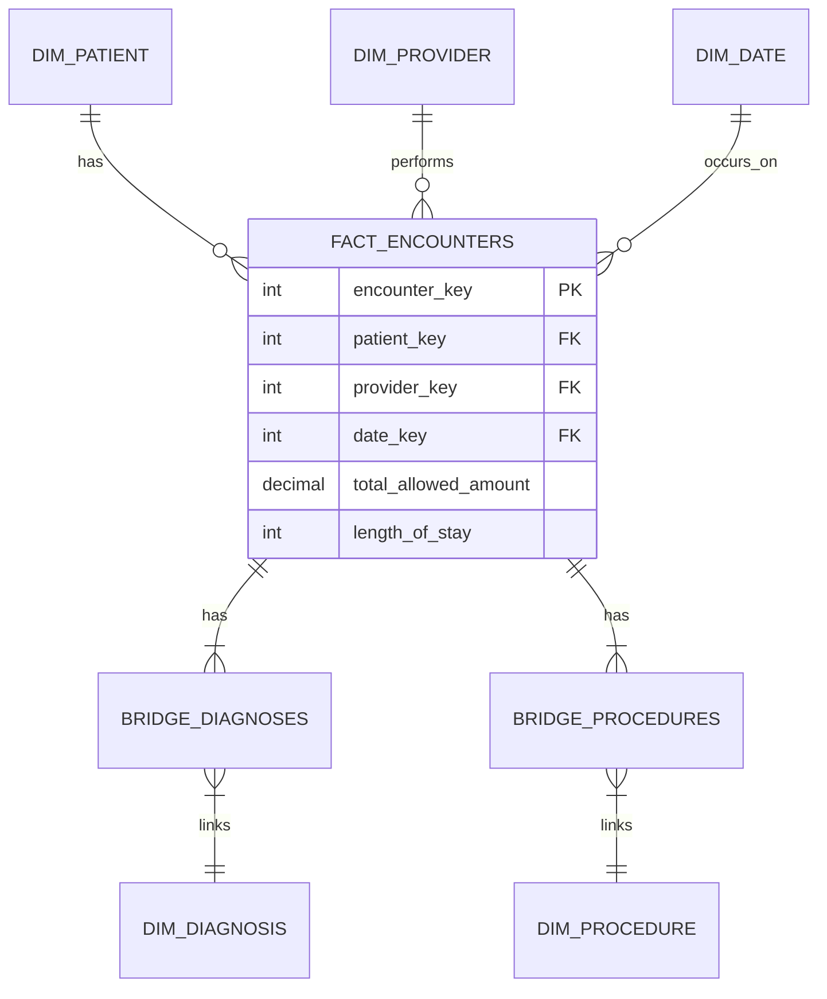

# Healthcare Data Warehouse Migration Project

## Overview
This project documents the design and implementation of a Data Warehouse (Star Schema) for a healthcare system. The primary objective is to migrate data from a normalized transactional (OLTP) system to a dimensional (OLAP) structure to resolve specific performance bottlenecks identified during complex reporting.

## Prerequisites & Setup
*   **Database**: MySQL 8.0 or compatible.
*   **Schema Setup**: Run the SQL script `schema_db_querry/db/star_schema.sql` to create the database structure.
*   **Data Loading**: This is a design lab; data loading assumes an ETL process as described in `etl_design.txt`.

## 1. Problem Statement: OLTP Performance Analysis
Analysis of the original transactional system (`query_analysis.txt`) revealed several critical bottlenecks:

*   **Monthly Encounters**: The use of `DATE_FORMAT()` in `GROUP BY` clauses prevented index utilization, forcing the database to create temporary tables and perform filesorts.
*   **Diagnosis-Procedure Pairs**: Analyzing Many-to-Many relationships required joining four tables (`encounters`, `encounter_diagnoses`, `diagnoses`, `procedures`), resulting in expensive full table scans.
*   **Readmission Rates**: Calculating readmissions required self-joins on the large `encounters` table, which performed poorly without specific composite indexes.
*   **Revenue Reporting**: Financial metrics required joining the `billing` table and summing amounts at runtime, which became slower as data volume increased.

## 2. Solution: Star Schema Architecture
To address these issues, a Star Schema was designed (`design_decisions.txt`) with the following components:

### Fact Table
*   **`fact_encounters`**:
    *   **Grain**: One row per encounter.
    *   **Optimization**: Includes pre-aggregated metrics (`total_allowed_amount`, `length_of_stay`, `diagnosis_count`) to eliminate the need for runtime calculations and joins to the billing table.

### Dimensions
*   **`dim_date`**: A pre-generated calendar table allowing efficient grouping by Year, Month, and Quarter without runtime functions.
*   **`dim_patient`**: Contains patient demographics and pre-calculated `age_group` buckets.
*   **`dim_provider`**: Links providers to their specialties and departments.
*   **`dim_specialty`** & **`dim_department`**: Normalized dimensions for specific reporting requirements.
*   **`dim_encounter_type`**: Categorizes the setting (Inpatient, Outpatient, ER).

### Bridge Tables
To handle Many-to-Many relationships without exploding the fact table grain:
*   **`bridge_encounter_diagnoses`**: Links encounters to multiple diagnoses.
*   **`bridge_encounter_procedures`**: Links encounters to multiple procedures.

## 3. ETL Strategy
The Extract, Transform, Load logic (`etl_design.txt`) defines how data moves from source to target:

*   **Dimension Loading**:
    *   **Strategy**: SCD Type 1 (Overwrite) for handling updates.
    *   **`dim_date`**: Populated via a generation script covering 2020-2040.
    *   **`dim_patient`**: Logic includes calculating age groups based on DOB.
*   **Fact Loading**:
    *   **Lookups**: Source IDs are swapped for Surrogate Keys (e.g., `patient_id` -> `patient_key`).
    *   **Metrics**: `length_of_stay` is calculated as `DATEDIFF(discharge, admission)`. Financials are summed from the billing source.
*   **Refresh Strategy**:
    *   Daily incremental loads.
    *   Logic to handle late-arriving facts by re-processing a 30-60 day window.

## 4. Query Improvements
The new schema enables optimized queries (`star_schema_qa.sql`):

1.  **Monthly Encounters**: Now groups by integer columns in `dim_date` (e.g., `d.year`, `d.month`), utilizing indexes efficiently.
2.  **Top Diagnosis/Procedures**: Uses Bridge tables to isolate the specific M:N analysis, avoiding Cartesian products with the main fact table.
3.  **Readmission Rate**: Simplified by using surrogate keys and cleaner date logic.
4.  **Revenue**: Queries now sum the pre-calculated `total_allowed_amount` directly from `fact_encounters`, removing the join to the billing table entirely.

## Project Files
*   **`etl_design.txt`**: Pseudocode and logic for the ETL pipeline.
*   **`design_decisions.txt`**: Detailed justification for the schema design choices.
*   **`query_analysis.txt`**: Performance breakdown of the legacy OLTP queries.
*   **`star_schema_queries.txt`**: The optimized SQL queries for the new Data Warehouse.

## 5. Verified Performance Benchmarks
The following benchark results (`bench_perf.py`) confirm the performance improvements on the local dataset

|Query Name                         | Avg Time (s)    | Min (s)    | Max (s) |
|:----------------------------------|----------------:|-----------:|---------|
|1. Monthly Encounters (OLTP)       | 0.0830          | 0.0712     | 0.0931  |
|1. Monthly Encounters (Star)       | 0.0820          | 0.0695     | 0.1010  |
|2. Top Diagnosis-Procedure (OLTP)  | 0.0718          | 0.0502     | 0.0998  |
|2. Top Diagnosis-Procedure (Star)  | 0.0661          | 0.0504     | 0.0878  |
|3. Readmission Rate (OLTP)         | 0.0626          | 0.0462     | 0.0696  | 
|3. Readmission Rate (Star)         | 0.0488          | 0.0367     | 0.0571  |
|4. Revenue (OLTP)                  | 0.1420          | 0.1057     | 0.1627  | 
|4. Revenue (Star)                  | 0.1118          | 0.0940     | 0.1379  |
